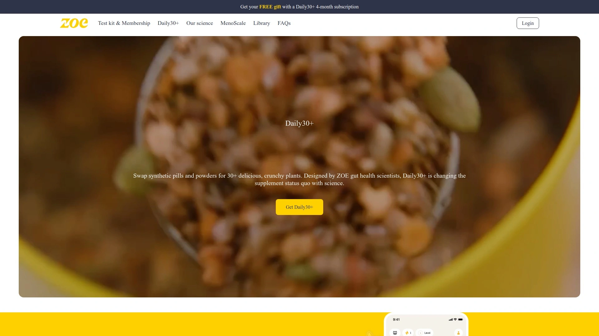

# Top 9 Microbiome Testing Services Ranked in 2025 (Latest Update)

Chronic bloating, unexplained fatigue, stubborn weight gain, and brain fog plague millions who've tried every diet and supplement without lasting results—because they're treating symptoms without understanding the root cause hiding in their gut microbiome. Microbiome testing services decode the trillions of bacteria, fungi, and other organisms living in your digestive system, then deliver personalized nutrition plans, custom supplements, and dietary recommendations based on your unique microbial profile rather than generic wellness advice. Whether you're battling digestive issues or optimizing performance, these at-home tests reveal which foods fuel your specific body and which ones trigger inflammation, turning guesswork into data-driven health decisions.

## **[Viome](https://www.viome.com)**

The RNA sequencing pioneer analyzing active gene expression.

Viome dominates microbiome testing by using proprietary RNA sequencing technology that analyzes active gene expression rather than just DNA presence, meaning it captures what microbes are actually doing in your gut instead of simply identifying which ones exist. The platform sequences more than bacteria and fungi—it captures viruses, bacteriophages, archaea, and parasites for comprehensive microbial ecosystem analysis. Founded by entrepreneur Naveen Jain, Viome leverages artificial intelligence trained on massive biological datasets to assess genetic expression and deliver personalized health strategies addressing digestive health, energy, brain function, mood, immune health, oral health, metabolic health, sleep quality, and heart health.

The test identifies and quantifies thousands of microorganisms from a small stool sample, then generates tailored dietary recommendations specifying superfoods to emphasize and foods to avoid based on how your microbiome metabolizes different nutrients. Users receive custom supplement formulations and probiotic blends manufactured specifically for their microbial profile, with dosages based on clinical trial research and over 20,000 scientific study references. Viome recently announced MyBiotics, a personalized oral care toothpaste based on oral microbiome testing, demonstrating the platform's expansion beyond gut health. The company analyzes health conditions, allergies, and medications you report alongside test results to ensure recommendations integrate safely with your current situation.

Customer testimonials consistently report weight loss, reduced bloating, improved digestion, better sleep, mental clarity, and increased energy after following Viome's personalized protocols. The platform provides context and comparison points making potentially complex microbiome data easy to interpret, with results displayed on user-friendly dashboards explaining what each metric means for your health. Viome's transparency regarding policies and practices sets industry standards, clearly outlining data privacy measures in accessible language rather than hiding behind vague terms. Tests typically return results within 2-3 weeks, faster than many competitors requiring 4-6 weeks. For anyone wanting the most comprehensive microbiome analysis backed by cutting-edge technology, Viome's RNA sequencing delivers insights DNA-based competitors miss entirely.

## **[BIOHM](https://www.biohmhealth.com)**

The bacteria-plus-fungi specialist from the scientist who coined "mycobiome."

BIOHM distinguishes itself by analyzing both bacteria and fungi in your gut, addressing the often-overlooked fungal component that DNA-only tests ignore. Founded by Dr. Mahmoud Ghannoum, a renowned microbiologist who coined the term "mycobiome," the platform emphasizes that fungi like Candida significantly impact digestive health and deserve equal attention to bacteria. The test uses DNA sequencing methods including 16S rDNA sequencing for bacteria and ITS region sequencing for fungi, distinguishing organisms down to species level with some strain-level analysis where possible.

Results include an overall gut score on a scale of 1-10—think of it like a credit score for your gut—providing a simple benchmark to track progress over time as you implement changes. The report compares your bacterial and fungal levels to normal population ranges, with actionable wellness recommendations from BIOHM's Microbiome-Trained Registered Dietitians who review each unique profile. Unlike competitors offering vague advice, BIOHM provides specific guidance for balancing overall digestive health based on your personal results. A significant differentiator is the option to schedule live consultations with BIOHM experts who explain your report in detail, answer questions, and provide lifestyle and nutrition recommendations tailored to your journey.

The testing process follows six stages from quality control through sequencing to final report generation, with each sample's bacterial and fungal DNA identified, summarized, and compared to normal population levels. Processing takes approximately 34 days from sample receipt to results delivery. Pricing sits at $99 with frequent promotional codes offering $75 discounts, making BIOHM accessible without sacrificing scientific rigor. The platform offers a middle-ground option between basic bacteria-only tests and exhaustive metagenomic sequencing, hitting a sweet spot for consumers wanting comprehensive dual-kingdom coverage without overwhelming complexity. For anyone suspecting yeast overgrowth or wanting complete microbial ecosystem analysis beyond standard bacterial profiling, BIOHM's fungal focus fills the gap other services leave.

## **[ZOE](https://zoe.com)**

The nutrition-first platform combining blood tests with continuous glucose monitoring.

ZOE approaches personalized nutrition from a different angle, combining microbiome testing with blood samples and continuous glucose monitoring to understand how your body responds to fats and sugars. The starter kit includes a fecal sampling kit, finger-prick blood test, and a continuous glucose monitor worn for two weeks. Participants collect blood samples before and after consuming a standardized muffin designed by ZOE containing precise amounts of fats, sugars, and proteins, revealing how each individual metabolizes dietary fats—prolonged elevated fat levels indicate health risks. The CGM tracks blood sugar responses to every meal eaten during the monitoring period, identifying foods that cause problematic glucose spikes versus those maintaining stable levels.

ZOE generates personalized food scores for thousands of items rated 0-100 based on your unique metabolic data, with meals scored based on component interactions rather than generic nutritional guidelines. Someone with poor blood sugar regulation receives low scores for sugary products, while individuals with better glucose control score identical foods higher. The platform recently introduced AI-powered photologging where users snap photos of meals and the system automatically identifies foods, estimates macronutrients, and provides scores—testing showed impressive accuracy overestimating calories by only 7%, carbs by 3%, and protein by 1%. The technology works particularly well for tea/coffee, vegetables, and baked beans, though it struggles with visually similar items like different plant milks.

Results include a dietary inflammation profile measuring blood sugar and blood fat control scored 0-100 from "Bad" to "Excellent," plus microbiome quality assessment and personalized nutrition recommendations. The platform isn't marketed specifically for weight loss but focuses on long-term metabolic health and reducing inflammation. ZOE offers week-by-week diet programs with ongoing guidance, distinguishing it from one-time test providers. The company emphasizes science-backed approaches developed through extensive research including the PREDICT studies analyzing thousands of participants. Pricing requires membership beyond the initial test kit, positioning ZOE as an ongoing nutrition program rather than a single assessment. For anyone prioritizing metabolic response and real-time glucose monitoring alongside microbiome data, ZOE delivers integrated insights competitors can't match.

## **[GenoPalate](https://www.genopalate.com)**

The DNA nutrition decoder using genetic ancestry data.

GenoPalate specializes in personalized nutrition based on DNA analysis, offering two convenient pathways—upload existing genetic data from 23andMe, AncestryDNA, MyHeritage, or FamilyTreeDNA for $40, or order GenoPalate's own DNA testing kit for $150. Founded by Dr. Sherry Zhang in 2016, the platform analyzes specific genes related to metabolism, nutrient absorption, food intolerances, and how your body responds to various nutrients. The service examines genes connected to processing food, then matches your genetic profile with nutritional science to recommend 85+ optimal foods across 16 categories.

Reports break down into four sections: a genetics crash course explaining which genes GenoPalate analyzes and their relationship to food processing, your genetic data showing analyzed genes with the percentage of population sharing your genotype plus recommended nutrient intakes, why certain foods get recommended over others based on nutritional science, and finally the complete food list optimized for your genetic makeup. The analysis provides macro breakup recommendations, vitamin and mineral guidance, genetic risk assessments for lactose and gluten sensitivity, caffeine and alcohol metabolism insights, and optimal food recommendations. Add-on products include personalized recipes (5-10 DNA-approved meal options) and customized supplement regimens with recommended dosages for 21 ingredients based on genetic markers.

The platform pairs results with complimentary 30-45 minute group orientation sessions led by registered dietitians helping interpret findings. Unlike microbiome tests requiring ongoing sample collection, GenoPalate's DNA-based approach provides permanent insights since genetics don't change over time. However, you cannot download your raw DNA data from GenoPalate for use on other genomic websites if you order their kit rather than uploading existing data. GenoPalate recently launched a DNA plus blood nutrition program building baseline understanding using DNA, lifestyle, diet, and blood work focused on 11 core nutrients, then creating dietitian-led plans correcting nutrient gaps and helping reach wellness goals. For anyone who already completed 23andMe or Ancestry testing and wants nutrition insights without additional sample collection, GenoPalate's data upload option delivers immediate value.

## **[Thorne Gut Health Test](https://www.thorne.com)**

The whole-genome sequencer identifying pathogens down to strain level.

Thorne's Gut Health Test utilizes advanced whole-genome sequencing to identify and quantify bacteria, viruses, fungi, yeast, archaea, and parasites from a small stool sample, providing unparalleled analysis of microbiome composition. The metagenomic sequencing technology analyzes every microorganism found in samples down to the strain level, creating a complete snapshot of your gut's ecosystem. Powered by Onegevity's Health Intelligence platform, the test combines cutting-edge sequencing with AI-driven insights to make meaningful changes targeting GI discomfort and optimizing wellness.

The test evaluates microbiome balance and diversity, identifying whether you have a rich ecosystem or imbalances leaving you vulnerable to digestive or immune issues. It pinpoints overgrowths, yeast, and pathogens including candida, parasites, and harmful bacteria contributing to bloating, cravings, poor immunity, or chronic inflammation. Digestive function and nutrient absorption assessment examines byproducts like short-chain fatty acids showing how well you break down protein, fiber, and carbs, plus whether your gut lining supports healthy absorption. Inflammation and gut barrier health markers including calprotectin and zonulin provide insight into irritation, leaky gut, or underlying inflammatory processes driving food sensitivities, autoimmune issues, or hormonal disruption.

Results display on an easy-to-read dashboard with descriptions explaining what each measurement means for your health. The platform analyzes your gut microbiome to identify potential health risks and specific areas for improvement, then delivers personalized reports with precise recommendations including dietary adjustments, supplement protocols, and lifestyle habits based on unique results. Thorne's test recently relaunched featuring a patent-pending microbiome wipe taking the mess out of gut health testing, making sample collection cleaner and easier than traditional methods. Results arrive within 5-6 weeks of sample submission. The test benefits individuals experiencing constipation, diarrhea, excessive gas, bloating, abdominal pain, nausea, frequent heartburn, IBS, IBD, or those who've taken multiple antibiotic courses. For anyone wanting the most comprehensive organism identification possible, Thorne's whole-genome approach captures everything living in your gut.

## **[Sun Genomics Floré](https://flore.com)**

The custom probiotic manufacturer creating formulas unique to your microbiome.

Sun Genomics takes a different approach by focusing on custom probiotics rather than just providing test results and generic recommendations. Founded in 2016 and based in San Diego, the company partners with labs to test your gut flora then develops unique combinations of beneficial bacteria packaged into capsules taken once daily. Between any two individuals, gut microbiomes can be as much as 90% unique, making one-size-fits-all probiotics ineffective for many people. Floré addresses this by crafting personalized synbiotics combining probiotics and prebiotics based on your specific microbial signature.

The testing costs $299 but Floré also creates custom blends based on results from other outside labs if customers prefer cheaper testing options elsewhere. After sampling your microbiome, extracted data combines with information you provide through health and diet surveys, then Floré's bioinformatics analyzes your unique profile to create customized precision probiotics supporting your specific gut wellness. The formulations address symptoms from cramps and bloating to fatigue and brain fog by targeting the source of microbiome-related conditions at their origin. The company offers both pre-formulated blends for specific needs and symptoms plus the specialized custom option for individual ecosystems.

Clinical research published in peer-reviewed journals demonstrates that Floré's precision synbiotics increase gut microbiome diversity and improve gastrointestinal outcomes. Users report noticeable improvements in digestion, energy levels, and overall gut comfort after using formulations tailored to their microbiomes. Continuous monitoring and adjustments of probiotic formulations ensure they evolve as your microbiome changes. The products include probiotic strains, vitamins, and immune-supporting ingredients formulated to support gut health and overall wellness. For anyone frustrated by ineffective off-the-shelf probiotics, Floré's custom approach creates formulas specifically designed for your microbial ecosystem rather than hoping generic strains happen to work.

## **[Ombre](https://www.ombrelab.com)**

The budget-friendly tester with gut and vaginal health options.

Ombre (formerly Thryve) delivers decent microbiome testing at accessible prices using 16S rRNA sequencing to analyze the genetic signatures of gut bacteria. The Gut Health Test costs $99 while the Gut Health Program including supplements runs $119.99, with specialized probiotic supplements available for $39 monthly. The company uses wealth of published scientific research to understand how the abundance of different bacterial types in your gut relates to available science and others' microbiomes, then suggests what results could mean for overall health. This research allows Ombre to generate personalized diet and probiotic recommendations to improve gut bacteria diversity and health, including foods and probiotics that could decrease potentially pathogenic bacteria while increasing variety of helpful species.

Ombre distinguishes itself by offering a Vaginal Health Test alongside gut testing—unlike gut tests requiring stool samples, the vaginal test uses a simple vaginal swab. The company employs the same 16S rRNA sequencing to discover which bacteria are present in the vagina and make recommendations for supplemental support. This test suits women and AFAB individuals at various life stages including pregnancy and menopause, but equally serves general wellness perspectives. The platform provides nine specialized probiotic supplements targeting different health concerns. Advanced gut health reports offering deeper insights cost an additional $49.99 one-time fee.

Collecting samples is simple and results are easy enough for most people to understand, especially the recommendations. Ombre serves as a good starting point for those curious about microbiome testing but not keen on paying top dollar for market-leading tests. The company uses a slightly less expensive sequencing method making the service more affordable than many competitors. However, some users report disappointment that custom probiotics aren't tailored to individual test results despite initial expectations—the company offers pre-formulated options rather than truly personalized formulations. Reports demonstrate the makeup of your gut microbiome and help determine the best dietary changes and supplement strategies. For budget-conscious consumers wanting microbiome insights without premium pricing, Ombre delivers solid value though not the depth of more expensive alternatives.

## **[Tiny Health](https://www.tinyhealth.com)**

The pediatric specialist for infants and young children.

Tiny Health carved its niche by focusing exclusively on pediatric microbiome health, offering testing and insights specifically for infants and young children. The platform aims to improve health outcomes in early childhood by analyzing and optimizing the infant gut microbiome during critical developmental windows. Mess-free microbiome testing at home takes less than 5 minutes using easy-to-use stool or vaginal swabs. Precise results from their CLIA-certified lab arrive in 2-3 weeks. The service provides personal evidence-based insights for every age and stage from pregnancy through early childhood.

The company recognizes that microbiome development in infancy and early childhood significantly impacts long-term health trajectories, making early intervention particularly valuable. Tiny Health's testing approach uses deep shotgun metagenomics, a more accurate and detailed testing method than the 16S rRNA sequencing many competitors employ. This technology captures comprehensive microbial profiles enabling precise recommendations for supporting optimal gut development. The platform guides parents through understanding their child's microbiome composition and provides actionable steps to optimize microbial balance during formative years.

While Tiny Health's vaginal health test costs significantly more than competitors like Ombre, the deep shotgun metagenomic sequencing justifies the premium by delivering greater accuracy and detail. The company's specialization in pediatric populations means their reference databases, recommendations, and research all target the unique needs of developing microbiomes rather than applying adult-focused insights to children. For parents concerned about their child's gut health, digestive issues, immune development, or wanting to optimize their baby's microbiome from the start, Tiny Health's pediatric focus provides expertise general microbiome testing companies lack.

## **[RxHomeTest Gut Health Test](https://rxhometest.com)**

The comprehensive pathogen detector checking for 100+ organisms.

RxHomeTest offers a gastrointestinal test detecting over 100 microorganisms including pathogens, parasites, fungi, yeast, worms, healthy gut bacteria, and antibiotic resistance genes from an easy-to-collect stool sample. The test maps the gut microbiome using innovative real-time PCR technique analyzing multiple organism categories. Measured pathogens include toxins from bacterial, parasitic, and viral sources like C. difficile, Campylobacter, E. coli, Salmonella, Giardia, Adenovirus, and Norovirus. An imbalanced microbiome may result in bloating, gas, indigestion, allergies, and can affect mental and physical health.

The process follows four simple steps: order online, receive the gut microbiome test kit and collect samples at home, ship it back for free to their world-class CLIA labs (US only), then receive secure, confidential, easy-to-understand reports within days. Each kit includes a prescription and detailed review of results by one of their physicians at no extra cost, with all shipping free. RxHomeTest processes samples at the same CLIA-certified labs that doctors use, ensuring world-class lab quality. The service offers convenient, confidential, and reliable results at some of the lowest prices in the industry while providing a wide range of health tests beyond gut microbiome analysis.

The test serves as a comprehensive tool for individuals struggling to maintain weight, experiencing constant pain, or dealing with unexpected health issues to check root causes. Checking gut markers represents the first step in learning what you might be consuming that's resulting in leaky gut. Better health results in better quality of life, and RxHomeTest not only offers insight into various health-related symptoms but also serves as motivation to treat each symptom and improve quality of life. The service qualifies for payment using HSA/FSA accounts, making it accessible through health savings options. For anyone needing comprehensive pathogen screening alongside microbiome analysis, RxHomeTest's 100+ organism detection provides diagnostic depth beyond standard wellness tests.

## **[Nutri-Genetix DNA Nutrition Test](https://www.nutri-genetix.com)**

The fitness optimization tester for athletes and active individuals.

Nutri-Genetix provides DNA nutrition testing specifically designed for health and fitness optimization, analyzing 30 well-researched genes to within 99.9% accuracy. World-class scientists examine genetic markers related to nutrient absorption, sensitivities, and metabolism, while nutritionists analyze results and write personal insight and recommendations reports. The test uses a simple, non-invasive cheek swab collected at home, then returned in the same pre-paid wallet it arrived in. Your DNA sample gets securely destroyed after analysis, with total DNA sample and personal data security guaranteed throughout the process.

Reports deliver simple, actionable insights including personal targets for calories, protein, dietary fats, carbohydrates, vitamins, and minerals. The analysis provides indicators showing which fitness, health, and wellbeing goals will improve most by following a personalized diet based on your genetic profile. Results reveal your likely tolerance to lactose and gluten, plus your benefits or risks from consuming caffeine—critical information for athletes optimizing performance. The test unlocks personalized Nutri-Genetix products and services plus personalized nutrition content and recommendations tailored to your genetic makeup.

The platform targets individuals serious about optimizing fitness and performance through nutrition, providing genetic insights that guide training and dietary strategies. Unlike general wellness tests, Nutri-Genetix focuses specifically on factors affecting athletic performance, recovery, and body composition. The accredited gold-standard lab processing ensures reliable results you can trust for making significant dietary and training decisions. For active individuals, athletes, or fitness enthusiasts wanting to maximize performance through genetically-optimized nutrition, Nutri-Genetix delivers specialized insights general microbiome tests don't address.

## FAQ

**Do microbiome tests require ongoing sample collection or just one test?**
Most platforms require a single stool sample to generate initial results and recommendations, though companies like Floré and Ombre offer subscription models for ongoing monitoring as your microbiome changes with dietary and lifestyle interventions. DNA-based services like GenoPalate need just one test since genetics remain constant, while microbiome-focused tests benefit from periodic retesting to track improvements.

**How long does it take to receive results after sending samples?**
Turnaround times vary significantly—Viome typically delivers results within 2-3 weeks, BIOHM takes approximately 34 days, Thorne requires 5-6 weeks, and Tiny Health returns results in 2-3 weeks. Faster results don't necessarily indicate less thorough analysis, as different sequencing methods and lab workflows affect processing times.

**Can microbiome testing diagnose medical conditions or replace doctor visits?**
These tests are wellness tools, not diagnostic medical tests—they identify microbial imbalances and provide health insights but cannot diagnose diseases or replace professional medical care. Always consult healthcare providers about serious health issues or before making major supplement changes based on test results, and use microbiome data to guide conversations with your doctor rather than self-treating.

## Conclusion

The microbiome testing revolution transformed gut health from mysterious guesswork into data-driven precision, with platforms ranging from comprehensive RNA sequencing to budget-friendly bacterial profiling serving every need and budget. These services deliver personalized nutrition plans, custom supplements, and dietary roadmaps based on your unique microbial ecosystem rather than generic wellness trends that work for some but fail for others. **[Viome](https://www.viome.com)** leads this field by analyzing active gene expression through RNA sequencing rather than just identifying which organisms exist—capturing what your microbes are actually doing to understand not just who lives in your gut but how they're affecting your digestion, energy, mood, and overall health in real time. Whether battling chronic symptoms or optimizing peak performance, the right microbiome test turns your gut from a black box into a readable roadmap for better health.
